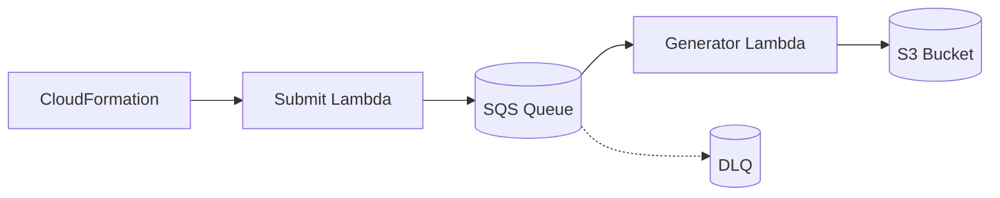

<h1 align="center" style="font-size: 3.5em; font-weight: bold;">VBVR DataFactory</h1>

<p align="center">
  <b>Scalable data generation for video reasoning models using AWS Lambda.</b>
</p>

<p align="center">
  <a href="https://github.com/VBVR-DataFactory">
    
  </a>
  
  
  
</p>

<p align="center">
  <a href="#one-click-deploy">Deploy</a> •
  <a href="#what-is-vbvr-datafactory">About</a> •
  <a href="#-getting-started">Quick Start</a> •
  <a href="#-architecture-overview">Docs</a>
</p>

**VBVR DataFactory** is a distributed data generation system built on AWS Lambda. It orchestrates 300+ generators from the [VBVR-DataFactory](https://github.com/VBVR-DataFactory) project to create high-quality training data for video reasoning models.




---

<div align="center">

## One-Click Deploy

**Deploy to your AWS account in minutes — no local setup required.**

<a href="https://console.aws.amazon.com/cloudformation/home?#/stacks/new?stackName=vbvr-datafactory&templateURL=https://raw.githubusercontent.com/video-reason/VBVR-DataFactory/main/cloudformation/VBVRDataFactoryPipelineStack.template.json">
  
</a>

**🔜 Coming Soon**

| S3 Bucket | SQS Queue | Lambda | DLQ |
|:---------:|:---------:|:------:|:---:|
| Output storage | Task queue | 300+ generators | Auto-retry |

</div>

<details>
<summary><b>After deployment — How to use</b></summary>

<br>

**Option 1: Invoke Submit Lambda (Recommended)**

Go to AWS Console → Lambda → `{stack-name}-submit-tasks` → Test with:

```json
{
  "generators": ["O-41_nonogram_data-generator", "O-42_object_permanence_data-generator"],
  "samples": 10000,
  "batch_size": 25
}
```

Or use AWS CLI:
```bash
aws lambda invoke \
  --function-name vbvr-datafactory-submit-tasks \
  --payload '{"samples": 10000}' \
  response.json
```

**Option 2: Send SQS Messages Directly**

Go to AWS Console → SQS → `{stack-name}-queue` → Send message:

```json
{
  "type": "O-41_nonogram_data-generator",
  "start_index": 0,
  "num_samples": 25,
  "seed": 42,
  "output_format": "tar"
}
```

**Download results:**
```bash
# Download all generated data
aws s3 sync s3://{stack-name}-output-{account-id}/questions/ ./results/

# Results will be in:
# ./results/G-41_generator/task_name_task/task_name_0000/
```

</details>

---

## 📁 Output Structure

All generated data follows this standardized structure:

```
questions/
├── G-1_object_trajectory_data-generator/
│   └── object_trajectory_task/
│       ├── object_trajectory_0000/
│       │   ├── first_frame.png
│       │   ├── final_frame.png
│       │   ├── ground_truth.mp4
│       │   └── prompt.txt
│       ├── object_trajectory_0001/
│       │   └── [same 4 files]
│       └── ... (continues with _0002, _0003, etc.)
│
├── G-2_another_generator/
│   └── another_task/
│       ├── another_0000/
│       └── ...
│
└── O-41_nonogram_data-generator/
    └── nonogram_task/
        ├── nonogram_0000/
        │   ├── first_frame.png
        │   ├── final_frame.png
        │   ├── ground_truth.mp4
        │   └── prompt.txt
        └── ... (continues with _0001, _0002, etc.)
```

**Structure breakdown:**
- **Root:** `questions/` - All generated data
- **Generator:** `{G|O}-{N}_{task-name}_data-generator/` - Each generator has its own folder
- **Task:** `{task-name}_task/` - Task-specific directory
- **Instances:** `{task-name}_0000/` - Individual samples with 4-digit zero-padded indices
- **Files:** Each instance contains 2-4 files (first_frame.png, prompt.txt are required; final_frame.png and ground_truth.mp4 are optional)

**Tar Archive Format:**

When using `--output-format tar`, files are packaged into compressed archives:

```
questions/
└── G-1_object_trajectory_data-generator_00000-00099.tar.gz

# Extract to see:
G-1_object_trajectory_data-generator/
└── object_trajectory_task/
    ├── object_trajectory_0000/
    │   └── [files]
    ├── object_trajectory_0001/
    └── ... (through _0099)
```

- **Tar files:** `{generator}_{start-index}-{end-index}.tar.gz`
- **Internal structure:** Preserves full `{generator}/{task}_task/{samples}/` hierarchy
- **Benefits:** Efficient download, reduced S3 requests, maintains organization

---

## 🚀 Getting Started

### Step 1: Install Prerequisites

```bash
# Verify Python 3.11+ (required)
python3 --version  # Should be 3.11 or higher

# Create and activate virtual environment (recommended)
python3 -m venv venv
source venv/bin/activate

# Install Node.js (required for AWS CDK CLI)
# Ubuntu/Debian:
curl -fsSL https://deb.nodesource.com/setup_20.x | sudo -E bash -
sudo apt install -y nodejs

# macOS:
# brew install node

# Verify Node.js installation:
node --version  # Should be v20.x or higher
npm --version

# Install AWS CDK CLI globally (required for deployment)
# Note: CLI version doesn't need to match aws-cdk-lib Python package version
sudo npm install -g aws-cdk@2.1100.3

# Verify CDK installation:
cdk --version  # Should be 2.1100.3

# --- macOS (Homebrew) ---
# brew install awscli
# brew install gh
# Install Docker Desktop from: https://www.docker.com/products/docker-desktop/

# --- Ubuntu/Debian (apt) ---
# sudo apt update
# sudo apt install -y curl unzip git python3-venv
#
# AWS CLI:
# Option A (pip, compatible with boto3/botocore): pip install awscli==1.44.16
# Option B (v2, standalone - no Python dependencies):
#   curl -L "https://awscli.amazonaws.com/awscli-exe-linux-x86_64.zip" -o awscliv2.zip
#   unzip -q awscliv2.zip
#   sudo ./aws/install
#   rm -rf awscliv2.zip aws
#
# GitHub CLI:
# sudo apt install -y gh
# (If `gh` isn't available in your distro repos, install from https://cli.github.com/)
#
# Docker (No Docker Hub account needed - this project uses AWS ECR):
# sudo apt install -y ca-certificates curl
# sudo install -m 0755 -d /etc/apt/keyrings
# sudo curl -fsSL https://download.docker.com/linux/ubuntu/gpg -o /etc/apt/keyrings/docker.asc
# sudo chmod a+r /etc/apt/keyrings/docker.asc
# echo "deb [arch=$(dpkg --print-architecture) signed-by=/etc/apt/keyrings/docker.asc] https://download.docker.com/linux/ubuntu $(. /etc/os-release && echo "$VERSION_CODENAME") stable" | sudo tee /etc/apt/sources.list.d/docker.list > /dev/null
# sudo apt update  # Required after adding Docker repository
# sudo apt install -y docker-ce docker-ce-cli containerd.io docker-buildx-plugin docker-compose-plugin
# sudo usermod -aG docker $USER  # Add your Linux user to docker group (avoid needing sudo)
# newgrp docker  # Or log out and back in to apply group changes
```

### Step 2: Configure AWS

```bash
# Configure AWS credentials
aws configure

# It will ask for:
# - AWS Access Key ID
# - AWS Secret Access Key
# - Default region (use: us-east-2)
# - Default output format (use: json)
```

### Step 3: Clone and Install

```bash
# Clone the repository
git clone https://github.com/video-reason/VBVR-DataFactory
cd VBVR-DataFactory

# Install the package with all dependencies
pip install -e ".[dev,cdk]"
```

### Step 4: Download Generators

```bash
# Authenticate with GitHub (first time only)
gh auth login

# Download all generator repositories
cd scripts
./download_all_repos.sh
cd ..

# This downloads all O- and G- generators from VBVR-DataFactory org to ./generators/
```

### Step 5: Deploy Infrastructure to AWS

```bash
# Make sure Docker is running first!
# - macOS/Windows: Docker Desktop
# - Linux: Docker Engine (dockerd)

# Ensure you're in the project root directory (VBVR-DataFactory/)
# If you're in the deployment subdirectory, go back:
# cd ..

# Bootstrap CDK (first time only)
cd deployment
cdk bootstrap
cd ..

# Deploy the infrastructure
cd deployment
cdk deploy
cd ..

# Wait for deployment to complete (~5-10 minutes)
# Save the outputs that appear at the end:
#   - QueueUrl
#   - BucketName
#   - DlqUrl
```

**After deployment completes, you'll see:**
```
Outputs:
VBVRDataFactoryPipelineStack.QueueUrl = https://sqs.us-east-2.amazonaws.com/123456789/vbvr-datafactory-pipeline-queue
VBVRDataFactoryPipelineStack.BucketName = vbvr-datafactory-123456789-us-east-2
VBVRDataFactoryPipelineStack.DlqUrl = https://sqs.us-east-2.amazonaws.com/123456789/vbvr-datafactory-pipeline-dlq
```

**Copy these values!** You'll need them in the next step.

### Step 6: Set Environment Variables

```bash
# Go back to project root
cd ..

# Set the queue URL and bucket from CDK outputs
export SQS_QUEUE_URL="https://sqs.us-east-2.amazonaws.com/123456789/vbvr-datafactory-pipeline-queue"
export OUTPUT_BUCKET="vbvr-datafactory-123456789-us-east-2"

# Optional: Set DLQ URL for monitoring failed tasks
export SQS_DLQ_URL="https://sqs.us-east-2.amazonaws.com/123456789/vbvr-datafactory-pipeline-dlq"

# Optional: Save to .env file for persistence
echo "SQS_QUEUE_URL=$SQS_QUEUE_URL" > .env
echo "OUTPUT_BUCKET=$OUTPUT_BUCKET" >> .env
echo "SQS_DLQ_URL=$SQS_DLQ_URL" >> .env
```

### Step 7: Submit Your First Tasks

```bash
# Test with a single generator (100 samples)
python scripts/submit.py \
  --generator G-1_object_trajectory_data-generator \
  --samples 100 \
  --batch-size 10

# This will:
# - Create 10 SQS messages (10 samples each)
# - Send them to the queue
# - Lambda will automatically process them
```

### Step 8: Monitor Progress

```bash
# Watch queue status in real-time
python scripts/monitor.py --watch

# You'll see:
# - Messages waiting in queue
# - Messages being processed
# - Progress percentage
```

### Step 9: Download Results

```bash
# Once processing is complete, download the generated data
aws s3 sync s3://vbvr-datafactory-123456789-us-east-2/questions/ ./results/

# Results structure (files format):
# results/
# └── G-1_object_trajectory_data-generator/
#     └── object_trajectory_task/
#         ├── object_trajectory_0000/
#         │   ├── first_frame.png
#         │   ├── final_frame.png
#         │   ├── prompt.txt
#         │   └── ground_truth.mp4
#         ├── object_trajectory_0001/
#         └── ...

# For tar format, download and extract:
# aws s3 cp s3://vbvr-datafactory-123456789-us-east-2/questions/G-1_generator_00000-00099.tar.gz .
# tar -xzf G-1_generator_00000-00099.tar.gz
```

---

## 🎯 Common Workflows

### Generate Large Dataset (All Generators)

```bash
# Submit 10,000 samples for ALL generators
python scripts/submit.py \
  --generator all \
  --samples 10000 \
  --batch-size 100 \
  --seed 42

# Monitor progress
python scripts/monitor.py --watch --interval 10

# This creates 100,000+ SQS messages
# Lambda processes them in parallel (up to 990 concurrent)
# Estimated time: ~2-4 hours depending on generators
```

### Generate Specific Generator Types

```bash
# Only O- generators
# First, edit scripts/download_all_repos.sh line 20:
# Change to: grep -E '^O-[0-9]+_'
cd scripts && ./download_all_repos.sh && cd ..

# Then submit tasks
python scripts/submit.py --generator all --samples 5000
```

### Check for Failed Tasks

```bash
# Monitor the Dead Letter Queue
python scripts/monitor.py --watch

# Look at the DLQ section
# If you see failed messages, they need investigation
```

---

## 📦 Using as a Library

You can import and use vbvrdatafactory in your own Python projects:

```python
from vbvrdatafactory.core.models import TaskMessage
from vbvrdatafactory.sqs.submitter import TaskSubmitter
from vbvrdatafactory.core.config import config

# Method 1: Submit using the submitter class
submitter = TaskSubmitter(queue_url="https://sqs.us-east-2.amazonaws.com/...")
result = submitter.submit_tasks(
    generators=["G-1_object_trajectory_data-generator"],
    total_samples=1000,
    batch_size=100,
    seed=42,
)
print(f"Submitted {result['total_successful']} tasks")

# Method 2: Create individual task messages
task = TaskMessage(
    type="G-1_object_trajectory_data-generator",
    num_samples=100,
    start_index=0,
    seed=42,
    output_format="files",
)

# Validate automatically with Pydantic
validated_json = task.model_dump_json()
# Use this JSON to send to SQS manually
```

---

## 🏗️ Architecture Overview

### What Gets Created

When you run `cdk deploy`, it creates:

1. **S3 Bucket** - Stores generated data
2. **SQS Queue** - Distributes tasks to workers
3. **Lambda Function** - Runs generators (3GB memory, 15min timeout)
4. **Dead Letter Queue** - Captures failed tasks for retry
5. **IAM Roles** - Permissions for Lambda to access S3/SQS

### How It Works

```
1. You run: python scripts/submit.py
   ↓
2. Creates task messages and sends to SQS Queue
   ↓
3. SQS automatically triggers Lambda (up to 990 concurrent)
   ↓
4. Lambda:
   - Validates message with Pydantic
   - Runs generator script
   - Uploads results to S3
   - Deletes message from queue
   ↓
5. If Lambda fails 3 times → message goes to DLQ
```

### Task Message Format

```json
{
  "type": "G-1_object_trajectory_data-generator",
  "num_samples": 100,
  "start_index": 0,
  "seed": 42,
  "output_format": "files"
}
```

**Output Format Options:**
- `"files"` (default) - Individual files uploaded to S3 with full directory structure
- `"tar"` - Compressed tar.gz archive per batch (e.g., `G-1_generator_00000-00099.tar.gz`)

All fields are validated by Pydantic. Invalid messages are rejected immediately.

---

## ⚙️ Configuration

### Required Environment Variables

```bash
export SQS_QUEUE_URL="https://sqs.us-east-2.amazonaws.com/.../vbvr-datafactory-pipeline-queue"
export OUTPUT_BUCKET="vbvr-datafactory-123456789-us-east-2"
```

### Optional Environment Variables

```bash
export AWS_REGION="us-east-2"              # Default region
export SQS_DLQ_URL="https://sqs..."        # For monitoring failed tasks
export GENERATORS_PATH="./generators"       # Local path to generators
```

### Lambda Configuration

Edit `deployment/cdk.json` to adjust:

```json
{
  "context": {
    "lambdaMemoryMB": 3072,            // 3 GB
    "lambdaTimeoutMinutes": 15,        // 15 minutes
    "sqsMaxConcurrency": 990           // Max parallel Lambdas
  }
}
```

---

## 🛠️ Available Scripts

### Submit Tasks

```bash
python scripts/submit.py --generator GENERATOR_NAME --samples NUM_SAMPLES

# Options:
#   --generator, -g    Generator name or "all" (required)
#   --samples, -n      Total samples per generator (default: 10000)
#   --batch-size, -b   Samples per Lambda task (default: 100)
#   --seed, -s         Random seed (optional)
#   --output-format    "files" or "tar" (default: files)
#   --bucket           Override output bucket (optional)

# Examples:
python scripts/submit.py -g all -n 10000
python scripts/submit.py -g G-1_object_trajectory_data-generator -n 1000 --seed 42
```

### Monitor Queue

```bash
python scripts/monitor.py

# Options:
#   --watch, -w        Continuous monitoring mode
#   --interval, -i     Refresh interval in seconds (default: 10)

# Example:
python scripts/monitor.py --watch --interval 5
```

### Download Generators

```bash
cd scripts
./download_all_repos.sh

# This downloads all O- and G- generators from vm-dataset org
# To download specific types, edit line 20 of the script
```

### Update Generator Dependencies

```bash
cd scripts
./collect_requirements.sh

# This collects requirements.txt from all generators
# and updates ../requirements-all.txt
# Run this when generators are added or updated
```

---

## 🐛 Troubleshooting

### Docker Not Running

**Error:** `Cannot connect to the Docker daemon`

**Solution:**
- macOS/Windows: Start Docker Desktop
- Linux: Start Docker Engine (e.g., `sudo systemctl start docker`)

### Module Not Found

**Error:** `ModuleNotFoundError: No module named 'pydantic'`

**Solution:**
```bash
pip install -e ".[dev,cdk]"
```

### AWS Credentials Not Configured

**Error:** `Unable to locate credentials`

**Solution:**
```bash
aws configure
# Enter your AWS Access Key ID and Secret Access Key
```

### Queue URL Not Set

**Error:** `SQS_QUEUE_URL environment variable not set`

**Solution:**
```bash
export SQS_QUEUE_URL="https://sqs.us-east-2.amazonaws.com/.../vbvr-datafactory-pipeline-queue"
```

Get this value from CDK outputs after deployment.

### Generator Not Found

**Error:** `Generator not found: ./generators/G-1_object_trajectory_data-generator`

**Solution:**
```bash
cd scripts
./download_all_repos.sh
cd ..
```

### Node.js Version Too Old

**Error:** `Node version 19 is end of life`

**Solution:**
```bash
# macOS (Homebrew):
# brew install node@20
#
# Ubuntu/Debian:
# sudo apt update
# sudo apt install -y nodejs npm
#
# If your distro Node is too old, prefer installing Node 20 via nvm or NodeSource.
```

---

## 🔧 Advanced Usage

### Update Infrastructure

```bash
# Make changes to deployment/cdk/stacks/pipeline_stack.py

# Preview changes
cd deployment
cdk diff

# Apply changes
cdk deploy
cd ..
```

### Clean Up AWS Resources

```bash
cd deployment
cdk destroy

# This deletes:
# - Lambda function
# - SQS queues
# - IAM roles
# Note: S3 bucket is retained (with your data)
```

### List Available Generators

```bash
ls generators/
# or
python scripts/submit.py --generator all --samples 0  # Will list and exit
```

---

## 📄 License

Apache-2.0

---

<p align="center">
  Part of the <a href="https://github.com/VBVR-DataFactory">VBVR-DataFactory</a> project
</p>
